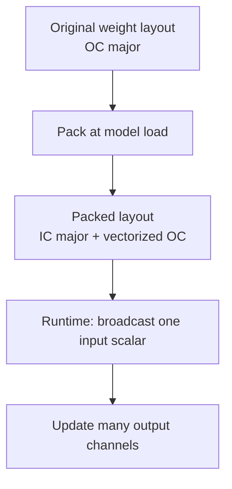
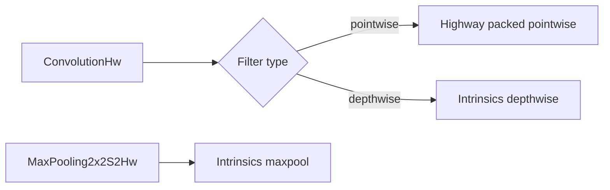
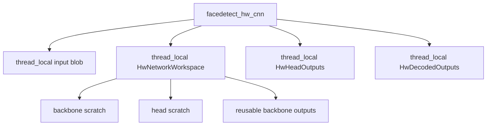

# Highway hw 性能优化报告

## 报告大纲

1. 摘要
   - 项目目标
   - 最终性能结果
   - 最核心的优化结论
2. 背景与问题定义
   - 原始实现形态
   - 独立 `hw` 实验线的价值
   - 约束条件和正确性要求
3. 基准测试与验证体系
   - 测试图片和运行环境
   - benchmark 设计
   - 单元测试与端到端一致性验证
   - 为什么必须同时看 micro benchmark 和 real-image benchmark
4. 总体优化路线
   - 从 primitive SIMD 到 packed kernel
   - 从局部 kernel 到完整网络
   - 从算术优化到内存生命周期优化
   - 从全局 profiling 到 hotspot kernel-only profiling
5. 关键优化点详解
   - 独立 Highway 工程与模型导入
   - 点卷积 packed weight layout
   - pointwise 策略选择器
   - hybrid ceiling：Highway pointwise + intrinsics depthwise/maxpool
   - depthwise 寄存器累加与 ReLU 融合
   - maxpool 完整窗口快路径
   - image transform 输出复用与零填充优化
   - FPN upsample-add 融合
   - workspace / output-parameter API
   - decode 直接 flatten
   - 64-output packed pointwise 特化
   - 64-channel depthwise 特化
6. 性能结果复盘
   - 每一阶段的端到端收益
   - stage breakdown
   - kernel-only hotspot 解读
   - 收益最大的优化类别
7. 高性能编程方法论总结
   - 先证明正确，再谈性能
   - 改变数据布局通常比替换指令更重要
   - 分配和清零是深度学习推理中的隐形瓶颈
   - profiling 必须逐层收敛
   - 可维护性与性能极限之间的折中
8. 可迁移经验
   - 适用于其他 CNN 推理工程的模式
   - 适用于 SIMD 库迁移的模式
   - 适用于嵌入式/移动端的注意点
9. 后续可能探索
   - 64-channel depthwise A/B
   - `conv_head` 专用 pointwise
   - line-buffer / operator fusion
   - post-decode filtering 融合
10. 附录
    - 关键文件
    - 常用构建和 benchmark 命令
    - 指标表

## 1. 摘要

本报告记录了 `libfacedetection` 中独立 `highway/hw` 实验线的性能优化过程。实验目标不是简单地把原有手写 SIMD 代码替换为 Highway，而是在不破坏原始实现的前提下，建立一条独立实现路径，逐步探索基于 Highway 的推理性能上限。

最终在测试图片 `images/cnnresult.png` 上，`facedetect_hw_cnn` 与原始 `facedetect_cnn` 保持完全一致的结果：

```text
image=images\cnnresult.png size=1280x960 step=3840
original faces=39
hw faces=39
result short mismatches=0
```

最终实测性能：

```text
original facedetect_cnn  avg=269.7163 ms
hw facedetect_hw_cnn     avg= 38.8514 ms
```

这意味着在该真实图片场景下，`hw` 路径相对原始实现约为 `6.9x` 加速。

最重要的结论是：本次优化的收益并非来自某一个单点技巧，而是来自一组相互配合的系统性改造：

- 用 packed pointwise kernel 改变 1x1 卷积的数据访问方式。
- 用 persistent filter plan 把权重重排成本移到模型初始化阶段。
- 用 hybrid 策略保留 Highway 在 pointwise 上的优势，同时在 x64 上选择更快的 intrinsics depthwise/maxpool。
- 用 fused ReLU、寄存器累加和窗口快路径减少额外 pass 与读写。
- 用 output-parameter API 和 `HwNetworkWorkspace` 消除大量临时 `HwBlob` 分配、清零和移动。
- 用 real-image benchmark、stage breakdown、kernel-only hotspot benchmark 逐层收敛瓶颈。

如果把这次过程抽象成一句高性能编程原则，就是：先用数据确认瓶颈，再选择优化层级；当 SIMD primitive 已经足够快时，真正的天花板往往在数据布局、内存生命周期和算子融合。

## 2. 背景与问题定义

原始工程中已有一套手写 SIMD 实现，覆盖了人脸检测 CNN 推理所需的核心算子。用户希望引入 Highway 1.3.0，建立一个独立版本，验证两个问题：

1. Highway 能否在保持跨平台可维护性的同时接近或超过手写 SIMD。
2. 如果仅做 primitive 替换不够，能否通过 weight packing、kernel loop reorder、workspace reuse 等方式继续逼近性能上限。

因此，`hw` 版本从一开始就被设计成独立实验线：

```text
highway/
  CMakeLists.txt
  include/
  src/
  tests/
  benchmark/
  docs/
```

这种隔离有几个工程价值：

- 原始 `src/` 实现不被扰动，便于 A/B 对照。
- `hw` 可以大胆尝试新的数据结构和 kernel API。
- benchmark、doctest、模型导入逻辑都可以围绕性能实验定制。
- 失败的策略可以丢弃，不污染主线实现。

### 2.1 正确性边界

本项目是检测模型推理，后处理包含 sigmoid、bbox decode、keypoint decode、confidence filtering、sort、NMS 和结果 buffer packing。小的浮点误差可能经由阈值放大为不同检测框。因此优化过程必须遵守两个层级的正确性要求：

- kernel / tensor 级：与 scalar reference 或原始 `CDataBlob` 流程保持误差容忍内一致。
- public API 级：`facedetect_hw_cnn` 输出 result buffer 与 `facedetect_cnn` 在测试图片上完全一致。

最终验证基线为：

```text
test cases:    16 |    16 passed
assertions: 79965 | 79965 passed
```

### 2.2 性能边界

本次优化过程中特别避免了一个常见误区：把“使用 SIMD 库”本身等同于“高性能”。初始 micro benchmark 很快证明，直接 Highway primitive 替换并不总是胜过手写 AVX2/FMA。尤其 depthwise 3x3，早期 Highway primitive 甚至慢于 scalar/intrinsics 路径。

因此，性能目标从“替换指令”升级为“重塑执行形态”：

- pointwise 1x1 不再逐输出通道做 dot-product，而是 packed layout 下多输出通道并行累加。
- depthwise 3x3 不再通过清零输出再多次读写累加，而是在寄存器中从 bias 开始累加。
- 网络前向不再每层返回新 `HwBlob`，而是由 workspace 复用中间 buffer。

## 3. 基准测试与验证体系

### 3.1 构建环境

Highway 依赖通过 `find_package` 查找预编译包：

```text
E:/projects/thirdParty/lib/highway-1.3.0
```

推荐配置命令：

```powershell
cmake -S highway -B build-hw -DFDT_HW_HIGHWAY_ROOT=E:/projects/thirdParty/lib/highway-1.3.0 -DOpenCV_DIR=E:/projects/thirdParty/lib/opencv-4.5.1/vs2022-x64-release/lib
```

测试命令：

```powershell
cmake --build build-hw --config Release --target fdt_hw_tests
.\build-hw\Release\fdt_hw_tests.exe
```

真实图片 benchmark：

```powershell
cmake --build build-hw --config Release --target fdt_hw_image_benchmark
$env:PATH='E:\projects\thirdParty\lib\opencv-4.5.1\vs2022-x64-release\bin;' + $env:PATH
.\build-hw\Release\fdt_hw_image_benchmark.exe images\cnnresult.png
```

### 3.2 Benchmark 分层

本项目使用三类 benchmark，每一类回答的问题不同。

| Benchmark 类型 | 目标 | 典型问题 |
|---|---|---|
| micro benchmark | 比较单个 kernel 形状 | packed pointwise 是否优于 primitive pointwise |
| stage benchmark | 比较网络阶段 | backbone、FPN/head、decode、NMS 谁是瓶颈 |
| hotspot kernel-only benchmark | 排除分配/生命周期噪声 | `conv2 pointwise1` 的 kernel 本体到底多慢 |

这种分层非常重要。单看端到端结果无法知道收益来自哪里，单看 micro benchmark 又可能误判真实网络中的内存生命周期成本。最终优化路线正是在三类数据之间不断交叉验证。

### 3.3 图：Benchmark 闭环


教学要点：

- 每次优化前先定位瓶颈。
- 每次优化后先跑正确性测试。
- 真实图片结果是最终裁判。
- hotspot benchmark 用于解释真实图片中的阶段耗时，而不是替代真实图片 benchmark。

## 4. 总体优化路线

整个优化过程可以分成五个阶段。

### 4.1 阶段一：建立独立实验线

这一阶段完成：

- `highway/CMakeLists.txt`
- Highway 1.3.0 `find_package`
- scalar reference kernels
- Highway primitive kernels
- AVX2/FMA intrinsics comparison kernels
- doctest 覆盖
- primitive benchmark

初始 benchmark 显示：

```text
shape rows=24 cols=32 channels=64 out_channels=64
scalar pointwise         avg=0.7055 ms
hw pointwise             avg=0.1939 ms
intrinsics pointwise     avg=0.1482 ms
```

Highway primitive pointwise 明显快于 scalar，但仍慢于手写 intrinsics。这告诉我们：如果只停留在 primitive 层，这条路线很难超过手写 SIMD。

### 4.2 阶段二：packed pointwise

第一个核心突破来自 pointwise 1x1。

原始 primitive 形态：

```text
for pixel:
  for output_channel:
    dot(input_channels, weights[output_channel])
```

问题在于每个输出通道都做一次横向 reduction。SIMD 会被横向求和限制，无法充分展开多个输出通道。

packed 形态：

```text
for pixel:
  for output_channel_block:
    acc[0..N] = bias[0..N]
    for input_channel:
      input_scalar = input[input_channel]
      acc[0..N] += input_scalar * packed_weights[input_channel][0..N]
```

权重从 `[output_channel][input_channel]` 转为 `[input_channel][output_channel_block]`，使同一个输入通道可以广播一次，同时更新多个输出通道。

早期收益：

```text
shape rows=24 cols=32 channels=64 out_channels=64
hw pointwise             avg=0.2233 ms
hw packed pointwise      avg=0.0612 ms
intrinsics packed pw     avg=0.0619 ms
```

这是第一个说明 Highway 可以达到甚至超过手写 intrinsics 的关键节点。但注意，胜利不是因为换了库，而是因为换了数据布局和循环顺序。

### 4.3 阶段三：完整网络迁移与 real-image 对齐

随后将真实模型导入 `hw`：

- 编译原有 `src/facedetectcnn-data.cpp`
- 从 `param_pConvInfo[53]` 加载权重
- 用 `HwModel` 保存 `HwFilter`
- 在 filter load 时创建 persistent pointwise plan

接着逐步迁移：

- backbone: conv0 到 conv5
- FPN/raw heads
- decode/concat/sigmoid
- image transform
- detection output / NMS / result buffer packing

每一步都用 doctest 与原始 `CDataBlob` 流程对齐。最终 public API 在 `cnnresult.png` 上达到：

```text
original faces=39
hw faces=39
result short mismatches=0
```

### 4.4 阶段四：stage profiling 与 workspace 化

最初完整 real-image 版本：

```text
original facedetect_cnn  avg=270.8535 ms
hw facedetect_hw_cnn     avg=111.5492 ms
```

这已经有约 2.4x 加速，但 stage breakdown 显示 backbone 仍是主瓶颈：

```text
image transform          avg=10.7554 ms
backbone                 avg=84.0578 ms
fpn + raw heads          avg=15.5387 ms
decode + concat          avg= 2.6202 ms
nms                      avg= 0.0759 ms
```

后续大量收益并非来自新的 SIMD 指令，而是来自减少中间 buffer 的分配、清零和移动：

- `ConvolutionHwTo`
- `ConvolutionDepthwisePointwiseHwTo`
- `MaxPooling2x2S2HwTo`
- `UpsampleX2AddHwTo`
- `ForwardNetworkHwTo`
- `HwNetworkWorkspace`
- `thread_local` public API workspace

### 4.5 阶段五：shape-specific kernel specialization

在 allocator churn 基本消除后，剩余瓶颈回到卷积本体。hotspot kernel-only benchmark 指出主要目标：

```text
conv_head pw+relu
conv0 pointwise/depthwise
conv2 pointwise1/depthwise1
```

最后一轮加入：

- 64-output Highway packed pointwise block。
- 64-channel intrinsics depthwise interior path。

最终 real-image 结果：

```text
original facedetect_cnn  avg=269.7163 ms
hw facedetect_hw_cnn     avg= 38.8514 ms
```

## 5. 关键优化点详解

### 5.1 独立 Highway 工程

独立工程是整个实验可控的前提。`hw` 版本没有直接改动原始推理主线，而是在 `highway/` 下建立完整实现。

关键收益：

- 可以并行维护 scalar、Highway、intrinsics 三种实现。
- 可以把 doctest 和 benchmark 直接绑定到实验目标。
- 可以使用真实权重和真实 public API 验证，而不是停留在 synthetic micro benchmark。
- 出现回退策略时，比如 depthwise 选择 intrinsics，不会破坏整体架构。

教学启发：高性能重构最好先建立隔离实验线。否则，很容易陷入“既要保证业务稳定，又要大规模试错”的双重压力。

### 5.2 Packed pointwise weight layout

pointwise 1x1 是 CNN 中非常典型的计算密集算子。它本质上是每个像素位置上的小矩阵向量乘。

原始权重布局：

```text
weights[output_channel][input_channel]
```

packed 权重布局：

```text
packed_weights[input_channel][padded_output_channel]
```

图示：



这种布局把横向 reduction 问题转化为多个输出通道并行累加。它的优势包括：

- 减少每个输出通道单独 dot-product 的控制开销。
- 避免大量 horizontal reduce。
- 同一个输入 scalar 可以复用到多个 output accumulators。
- 与 Highway vector lane 自然匹配。

最终 64-output block 更进一步，一次处理 8 个 SIMD vectors，对 AVX2 width 即 64 个 float 输出通道。

关键代码位置：

- `PackedPointwiseFilter`
- `PointwisePlan`
- `Pointwise1x1PackedHw`
- `Pointwise1x1PackedHwImpl`

### 5.3 策略选择器：不是所有 shape 都适合 packed

检测头存在 1、4、10 这样的小输出通道层。如果强行 packed，会引入 padding 和 tail handling 成本。于是加入策略：

```text
packed    when channels >= 16 and out_channels >= 16
primitive otherwise
```

教学启发：高性能实现不应迷信单一 kernel。不同 shape 对应不同最佳策略。真正可靠的做法是用 plan/strategy 把选择显式化，并让 benchmark 驱动阈值。

### 5.4 Hybrid ceiling：Highway 与 intrinsics 混合

初始 micro benchmark 显示：

- Highway packed pointwise 表现很好。
- Highway depthwise 不如 intrinsics。
- x64 上 intrinsics maxpool 也更快。

因此最终采用 hybrid ceiling：

```text
pointwise 1x1  -> Highway packed
depthwise 3x3  -> intrinsics
maxpool 2x2    -> intrinsics
vector add     -> Highway
```

图示：



这是一个非常重要的工程判断：项目目标是性能上限，而不是纯粹证明 Highway 覆盖所有算子。Highway 提供了跨平台 SIMD 抽象，但性能路线仍然允许局部选择最快 backend。

### 5.5 Depthwise 寄存器累加与 fused ReLU

早期 depthwise 实现的大致形态是：

```text
memset(output, 0)
for each 3x3 neighbor:
  output += input * weight
output += bias
relu(output)
```

问题：

- 输出先清零，额外写一次大 buffer。
- 每个 neighbor 都读写 output，导致 partial sum 在内存中往返。
- ReLU 又单独扫一次 output。

优化后：

```text
acc = bias
for each 3x3 neighbor:
  acc = fma(input, weight, acc)
if do_relu:
  acc = max(acc, 0)
store acc
```

收益来自：

- partial sum 保持在寄存器。
- 去掉 output clear。
- ReLU 融合进 store 前。
- interior 像素使用无边界检查快路径。

这一阶段 public API 从约 98-102 ms 降到约 84 ms，是非常大的单点收益。

### 5.6 Maxpool 完整窗口快路径

2x2 stride-2 maxpool 的绝大多数输出位置都有完整 2x2 输入窗口。通用边界循环会为每个输出点计算 `rend/cend` 并嵌套循环。

优化后：

- interior 完整窗口直接加载四个位置。
- 做两次 max，再最终 max。
- 边界位置仍走通用路径。

这类优化的教学价值在于：边界处理应从 hot path 中拆出去。深度学习推理中，大多数像素是 interior，少数边界不应污染主循环。

### 5.7 FPN upsample-add 融合

原始 FPN 逻辑：

```text
upsampled = UpsampleX2(fb3)
fb2 = ElementAdd(upsampled, lateral)
```

优化后：

```text
fb2 = UpsampleX2Add(fb3, lateral)
```

收益：

- 去掉中间 upsample blob。
- 每个输入像素直接写四个输出位置，并与 lateral 相加。
- 降低内存带宽与临时分配。

这类算子融合的原则是：如果中间结果只被消费一次，且消费模式简单，优先考虑 producer-consumer fusion。

### 5.8 Output-parameter API 与 workspace

这是本项目收益最大的类别之一。

早期 layer API 形态：

```cpp
HwBlob ConvolutionHw(const HwBlob& input, const HwFilter& filter);
```

这种写法简洁，但在推理热路径上有隐性成本：

- 每层构造新 `HwBlob`。
- vector 分配或扩容。
- shape 变化导致反复释放/申请。
- 返回值和移动虽然通常被优化，但不能解决容量复用问题。
- 大量临时 blob 生命周期短，但尺寸大。

优化后：

```cpp
void ConvolutionHwTo(const HwBlob& input,
                     const HwFilter& filter,
                     bool do_relu,
                     HwBlob* output);
```

配合：

```cpp
struct HwNetworkWorkspace {
    HwBackboneOutputs backbone_outputs;
    HwBlob backbone_fx;
    HwBlob backbone_pointwise;
    HwBlob backbone_block;
    HwBlob backbone_output;
    HwBlob head_pointwise;
    HwBlob head_branch;
};
```

public API 使用：

```cpp
thread_local HwBlob input;
thread_local HwNetworkWorkspace network_workspace;
thread_local HwHeadOutputs head_outputs;
thread_local HwDecodedOutputs decoded;
```

图示：



这一类优化让 public API 从约 84 ms 逐步降到 64 ms、56 ms、41 ms，说明 allocator churn 和 buffer lifetime 是端到端推理中非常大的隐形成本。

### 5.9 Image transform 输出复用与零填充优化

图像输入转换将 BGR 图像按 3x3 S2/P1 模式转换为 32-channel initial blob。早期问题：

- 每次构造新的大 blob。
- 为了边界和 padding，整块 clear。
- 内部像素也承担了不必要的清零成本。

优化后：

- `ImageToInitialBlobHwTo` 写入 caller-owned blob。
- public API 复用 `thread_local input`。
- interior 像素写 27 个 BGR neighborhood 通道 + 5 个 padding 零。
- 只有边界/补齐位置清 32 个通道。
- 3-channel BGR 路径展开。

stage benchmark 中，复用测法下 image transform 约为 2.4 ms，不再是主要瓶颈。

### 5.10 Decode 直接 flatten

早期 decode/concat：

```text
BlobToVector(level0)
BlobToVector(level1)
BlobToVector(level2)
Concat3(...)
```

每个输出类型 cls/reg/kps/obj 都要创建多个临时 blob。

优化后：

```text
Flatten3To(level0, level1, level2, decoded_output)
```

收益：

- 直接写最终 decoded blob。
- 少分配临时对象。
- 少做一次 concat copy。
- decoded outputs 也可以被 public API 复用。

decode + concat 从约 2.5 ms 降到约 2.2 ms，绝对收益不如 convolution 大，但作为末端清理是合理的。

### 5.11 64-output packed pointwise 特化

hotspot kernel-only benchmark 显示 `conv2 pointwise1` 是剩余核心热点之一。它是 64-output shape。原来的 packed kernel 主要以 4-vector block 为主，在 AVX2 下即每轮 32 个输出通道。64 输出会运行两轮，对同一个 input channel 重复 broadcast 两次。

新增 8-vector block 后：

```text
for output_channel_block of 64:
  acc0..acc7 = bias
  for input_channel:
    x = broadcast(input[input_channel])
    acc0..acc7 += x * weight0..weight7
```

micro benchmark 信号：

```text
shape rows=24 cols=32 channels=64 out_channels=64
hw planned pointwise     avg=0.0469 ms
intrinsics planned pw    avg=0.0631 ms

shape rows=12 cols=16 channels=64 out_channels=64
hw planned pointwise     avg=0.0107 ms
intrinsics planned pw    avg=0.0157 ms
```

real-image 中：

```text
hw facedetect_hw_cnn     avg= 38.8514 ms
```

这说明 shape specialization 在性能极限阶段仍然有效。

### 5.12 64-channel depthwise 特化

为 64-channel depthwise interior 路径增加双 AVX2 vector unroll：

```text
ch += 16
  acc0 = channels ch..ch+7
  acc1 = channels ch+8..ch+15
```

这个优化收益比 64-output pointwise 小，且真实图中噪声更明显。当前结论是先保留，但后续应做 focused A/B benchmark 决定是否永久化。

教学启发：不是每个看起来“更展开”的 kernel 都一定稳定更快。寄存器压力、指令调度、cache 行为都可能抵消收益。性能优化需要允许候选策略存在，并用数据裁决。

## 6. 性能结果复盘

### 6.1 端到端演进

| 阶段 | original avg | hw avg | 约加速比 | 关键变化 |
|---|---:|---:|---:|---|
| real image baseline after FPN fusion | 270.85 ms | 111.55 ms | 2.4x | 完整 hw API + FPN fusion |
| hybrid ceiling + block profiling | 262.79 ms | 98.13 ms | 2.7x | depthwise/maxpool hybrid |
| fused depthwise | 265.58 ms | 84.17 ms | 3.2x | depthwise register accumulation + fused ReLU |
| workspace + fused pointwise | 268.77 ms | 64.01 ms | 4.2x | layer/network scratch reuse |
| input/decode cleanup | 271.70 ms | 56.16 ms | 4.8x | input blob reuse + direct flatten |
| full network workspace | 267.41 ms | 41.56 ms | 6.4x | persistent network/head/decoded outputs |
| 64-channel specialization | 269.72 ms | 38.85 ms | 6.9x | 64-output pointwise + 64-channel depthwise |

### 6.2 最终 stage breakdown

```text
image transform          avg= 2.4536 ms
backbone                 avg=29.9302 ms
fpn + raw heads          avg= 8.2240 ms
network workspace        avg=37.6668 ms
decode + concat          avg= 2.1938 ms
nms                      avg= 0.0955 ms
```

可以看到，最终主要时间仍在卷积网络：

```text
network workspace ~= 37.7 ms
postprocess ~= 2.3 ms
image transform ~= 2.5 ms
```

NMS 已经不是优化对象。

### 6.3 Hotspot kernel-only profile

```text
conv_head pw+relu        avg= 5.0693 ms
conv0 pointwise          avg= 3.3526 ms
conv0 depthwise          avg= 2.8557 ms
conv2 pointwise0         avg= 1.5234 ms
conv2 depthwise0         avg= 1.0947 ms
conv2 pointwise1         avg= 2.4610 ms
conv2 depthwise1         avg= 2.2397 ms
```

此处的教学价值在于，kernel-only 时间与 stage 时间不完全相同。stage 时间包含：

- wrapper 调用
- workspace 写入
- shape resize
- graph-level 数据流
- cache 状态差异

所以不能只看 kernel-only，也不能只看 stage。两者结合才能解释瓶颈。

## 7. 高性能编程方法论总结

### 7.1 先建立正确性护栏

本次优化一直保持 doctest 通过。每次 kernel 改动后都运行：

```text
test cases:    16 |    16 passed
assertions: 79965 | 79965 passed
```

高性能编程的第一原则不是“写快代码”，而是“让快代码可以被安全修改”。没有正确性护栏，优化越深入，回归成本越高。

### 7.2 改变数据布局往往比换 SIMD API 更重要

Highway primitive pointwise 初期没有超过手写 intrinsics。真正的突破来自 packed weight layout。这个案例说明：

- SIMD 库只提供表达能力。
- 数据布局决定 SIMD 是否能持续喂饱。
- loop order 决定寄存器能否复用。
- packing 把一次性成本移到初始化阶段，换取每帧收益。

### 7.3 分配、清零和临时对象是推理热路径的常见瓶颈

从 84 ms 到 64 ms，再到 56 ms、41 ms，主要不是数学运算优化，而是生命周期优化：

- output-parameter API
- `ResizeForOverwrite`
- `HwNetworkWorkspace`
- `thread_local` public API buffers
- direct flatten

这说明对于小模型、轻量 CNN、移动端推理，allocator churn 和 memory clear 很可能与 SIMD kernel 同等重要。

### 7.4 Hot path 要剥离边界处理

depthwise、maxpool、image transform 都体现了同一原则：

```text
if interior:
  run fast path
else:
  run generic boundary path
```

边界像素很少，但如果边界判断进入最内层循环，会拖慢绝大多数 interior 像素。

### 7.5 优化要允许 hybrid

最终实现并不是纯 Highway：

- Highway packed pointwise 是主力。
- x64 depthwise/maxpool 使用 intrinsics。

这是一种务实选择。高性能工程中，抽象层不应阻止局部最优实现。好的架构应该允许 backend strategy 选择，而不是把所有算子强行塞进同一种实现。

### 7.6 Benchmark 要能回答下一步问题

本项目 benchmark 是逐步演进的：

1. primitive benchmark：判断 Highway primitive 是否值得继续。
2. packed benchmark：验证数据布局改变是否有效。
3. real-image benchmark：验证端到端结果。
4. stage breakdown：定位网络级瓶颈。
5. pointwise/depthwise breakdown：定位 block 内部瓶颈。
6. hotspot kernel-only：区分 kernel 本体与生命周期成本。

每一次 benchmark 扩展都服务于一个明确问题，而不是为了“多测一些数字”。

## 8. 可迁移经验

### 8.1 对 CNN 推理工程

可迁移模式：

- 对 1x1 convolution 优先考虑 packed output-channel layout。
- 对 depthwise convolution 优先关注内存读写，而不是只关注乘加次数。
- 对 FPN/neck 中的 upsample + add 做 producer-consumer fusion。
- 对固定拓扑模型使用 persistent workspace。
- 对 public API 使用 thread-local 或 caller-owned workspace，减少 steady-state allocation。

### 8.2 对 SIMD 库迁移

迁移 Highway、xsimd、SIMDe 或其他 SIMD 抽象库时，可以遵循：

1. 先做 primitive parity。
2. 再做 micro benchmark。
3. 不要急着全量替换原实现。
4. 找出适合库抽象的算子。
5. 对不适合的算子保留平台特化 backend。
6. 用 strategy/plan 隔离选择逻辑。

### 8.3 对移动端/嵌入式

移动端还需要额外关注：

- L1/L2 cache 更小，workspace 和 packing 的收益可能更明显。
- NEON lane width 与 AVX2 不同，64-output block 是否合适需要重新 benchmark。
- thread-local workspace 在多线程调用模型下要评估内存占用。
- Highway dynamic dispatch 可能有分发成本，应单独衡量。

## 9. 后续可能探索

当前已经基本接近本轮目标性能极限，但仍有几个可探索方向：

1. A/B 64-channel depthwise specialization
   - 当前收益较小且有噪声。
   - 可通过 compile option 单独开关比较。

2. `conv_head` 专用 pointwise
   - shape 为大图、32 输入、16 输出。
   - 当前 hotspot 仍约 5 ms。
   - 可尝试专门的 16-output/32-input fully unrolled path。

3. line-buffer fusion
   - 对 depthwise + pointwise 串联做更深融合。
   - 风险较高，会显著增加代码复杂度。
   - 只有在确认 memory traffic 是主要瓶颈时再做。

4. decode/filter fusion
   - 把 confidence filtering 提前到 decode 阶段。
   - 可能减少 decoded tensor 写出量。
   - 但目前 decode + NMS 占比已经很小，优先级不高。

## 10. 附录

### 10.1 关键文件

| 文件 | 作用 |
|---|---|
| `highway/CMakeLists.txt` | 独立 hw 构建、Highway/OpenCV 查找、编译选项 |
| `highway/src/hw_kernels_hw.cpp` | Highway primitive 与 packed pointwise kernel |
| `highway/src/hw_kernels_intrinsics.cpp` | AVX2/FMA comparison 与 hybrid depthwise/maxpool |
| `highway/src/hw_layers.cpp` | layer wrapper、output-parameter API、hybrid backend dispatch |
| `highway/src/hw_network.cpp` | backbone、FPN/head、network workspace |
| `highway/src/hw_image.cpp` | image transform 与 output reuse |
| `highway/src/hw_postprocess.cpp` | decode、flatten、NMS |
| `highway/tests/hw_test_kernels.cpp` | correctness tests |
| `highway/benchmark/hw_benchmark.cpp` | micro benchmark |
| `highway/benchmark/hw_image_benchmark.cpp` | real-image benchmark 与 hotspot profiling |

### 10.2 最终结果摘要

```text
original facedetect_cnn  avg=269.7163 ms
hw facedetect_hw_cnn     avg= 38.8514 ms
speedup ~= 6.9x
```

```text
test cases:    16 |    16 passed
assertions: 79965 | 79965 passed
```

### 10.3 教学案例关键词

- SIMD abstraction is not enough
- data layout first
- packed kernel
- persistent plan
- output-parameter API
- workspace reuse
- fused activation
- boundary fast path
- hybrid backend
- benchmark hierarchy
- correctness guardrail

