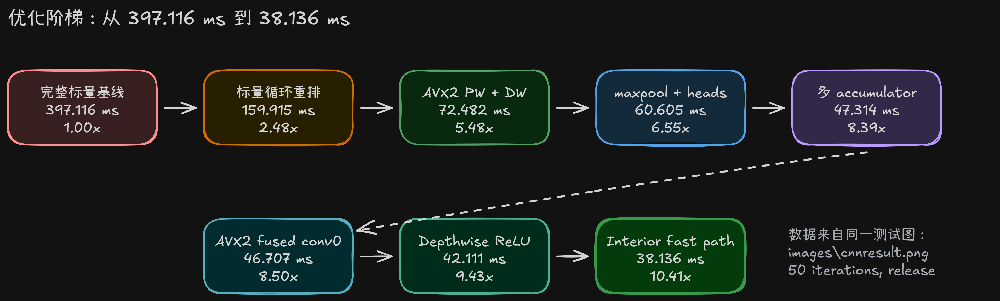
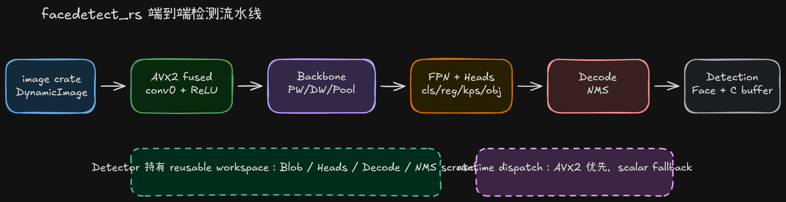
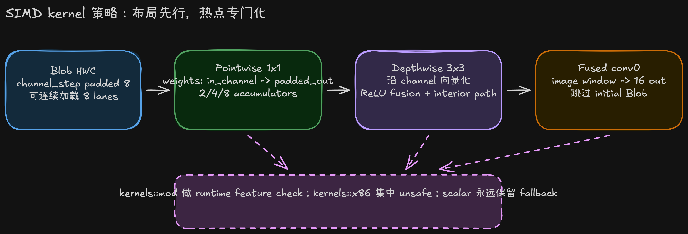

# facedetect_rs 高性能优化技术报告

日期：2026-05-04  
目标：将现有无第三方依赖的人脸检测实现迁移到 pure Rust，并在保持简单用户接口的前提下尽可能逼近 C++/Highway 优化版本性能。

## 摘要

`facedetect_rs` 已经从一个只写空结果的 Rust API 骨架，推进到可以加载现有 CNN 静态模型、执行完整前向网络、完成 decode/NMS、输出 Rust 结构化结果和 C 兼容结果缓冲区的高性能实现。当前生产路径在 `images\cnnresult.png` 上的 clean hot-start release benchmark 为：

```text
cargo run --release --example benchmark -- ..\images\cnnresult.png 50
faces: 45
avg_ms: 38.136
```

相对于早期完整标量基线 `397.116 ms`，最终版本达到 `10.41x` 加速。这个结果来自一组连续、可验证、低风险的优化，而不是一次性重写：数据布局先行、模型加载时预打包、workspace 复用、分阶段 benchmark、AVX2 runtime dispatch、pointwise/depthwise/maxpool/fused conv0 等热点 kernel 专项优化，以及最后的 depthwise interior fast path。

本报告面向教学使用，重点不是只展示最终代码，而是复盘性能工程中更重要的过程：如何找到瓶颈、如何设计可回退的实验、如何识别负优化、如何在 Rust 中管理 `unsafe` SIMD 边界，以及如何让用户接口仍然简单。

## 教学图

- [整体检测流水线](diagrams/rs-pipeline-architecture.excalidraw)

- [优化阶梯与性能曲线](diagrams/rs-optimization-timeline.excalidraw)

- [SIMD kernel 策略](diagrams/rs-simd-kernel-strategy.excalidraw)


这些文件是 Excalidraw JSON，可用 Excalidraw 网站或 VS Code Excalidraw 插件打开。

## 设计约束

这个项目的约束比“写一个最快 demo”更严格：

- 用户接口必须简单：用户只需要用 `image` crate 读取图片，然后调用 `detector.detect(&image)`。
- 支持 RGB/BGR 低层输入，但安全 API 不要求用户理解通道顺序，也不要求用户手动转换。
- 模型权重继续以现有 C++ 静态权重为源，避免维护第二份大权重文件。
- 热路径不依赖第三方加速库；SIMD 使用 Rust 标准库 `std::arch`。
- x86/x86_64 AVX2 优化必须 runtime dispatch，非 AVX2 平台继续走标量 fallback。
- 公共结果同时支持 Rust 结构化 `Face` 和现有 C 兼容 result buffer。
- 优化必须可验证：每轮优化后运行 `cargo test` 和 `cargo clippy --all-targets -- -D warnings`。

这组约束决定了最终路线：先建立稳定的 tensor/model/kernel 抽象，再逐个替换热点 kernel，而不是在一开始写大量平台相关代码。

## 最简单用户接口

最终库的使用方式刻意保持朴素：

```rust
use facedetect_rs::{image, Detector};

fn main() -> Result<(), facedetect_rs::DetectError> {
    let image = image::open("face.jpg")?;
    let mut detector = Detector::new();
    let detection = detector.detect(&image)?;

    println!("faces: {}", detection.face_count());
    for face in detection.faces() {
        println!(
            "score={:.2} box=({}, {}, {}, {})",
            face.score, face.x, face.y, face.width, face.height
        );
    }

    Ok(())
}
```

性能实现隐藏在 `Detector` 内部。用户不需要传入 BGR buffer、width、height、step，也不需要知道模型内部是 HWC、padding 到 8 lane，还是 AVX2 dispatch。低层 `detect_rgb` / `detect_bgr` 和 C ABI 仍然保留，用于 benchmark、已有 buffer 和兼容调用。

## Benchmark 方法

基准图像：

```text
images\cnnresult.png
```

主要命令：

```powershell
cargo run --release --example benchmark -- ..\images\cnnresult.png 50
cargo run --release --example benchmark_phases -- ..\images\cnnresult.png 50
cargo run --release --example benchmark_network_groups -- ..\images\cnnresult.png 50
```

benchmark 设计原则：

- release 构建；
- 单张图 warmup 后重复 N 次；
- 复用一个 `Detector`，避免把模型加载和 workspace 分配混入热路径；
- 使用 `std::time::Instant` 和 `std::hint::black_box`，不引入 Criterion；
- 用 phase benchmark 拆分 input/network/decode/output；
- 用 network group benchmark 继续拆 backbone、FPN、head 等子区域。

当前最终 phase 结果：

```text
faces: 45
input_ms:          2.617
network_ms:       37.586
fused_network_ms: 37.843
decode_ms:         0.720
output_ms:         0.040
sum_ms:           40.964
fused_sum_ms:     38.603
```

这里可以看到性能主要仍由 network 前向主导。decode/NMS 和结果写出已经不是关键瓶颈。

## 优化总览

| 阶段 | avg_ms | 相对初始基线 | 关键变化 |
| --- | ---: | ---: | --- |
| 完整标量 packed pointwise 基线 | 397.116 | 1.00x | 完整 pipeline 可跑通，但 pointwise 循环顺序低效 |
| packed pointwise 标量循环重排 | 159.915 | 2.48x | bias copy once，输入通道外层，输出通道连续写 |
| AVX2 pointwise + depthwise | 72.482 | 5.48x | `std::arch` AVX2 runtime dispatch |
| 小 head 优化 + AVX2 maxpool | 60.605 | 6.55x | 小输出标量路径、pool SIMD 化 |
| 全 head packed + 多 accumulator AVX2 | 47.314 | 8.39x | 1/4/10 输出 head 也走 packed，减少 broadcast |
| AVX2 fused conv0 | 46.707 | 8.50x | 从图像直接计算第一层，跳过 initial blob |
| depthwise + ReLU fusion | 42.111 | 9.43x | 去掉 depthwise 后独立 ReLU pass |
| depthwise interior fast path | 38.136 | 10.41x | 非边界像素展开 9-sample，边界保留通用路径 |

从数据上看，真正的突破来自三类优化：

1. 改变数据访问顺序，让 CPU 更容易连续读写；
2. 把高频小计算搬到 AVX2 lane 上；
3. 消除热路径上的中间结果和额外 pass。

## 架构演进

### 1. Blob：先定义可优化的数据容器

性能优化的第一步不是写 SIMD，而是选对内存形状。Rust 实现使用 `Blob` 作为内部 tensor 容器：

- HWC `f32` 存储；
- channel 维度 padded 到 8 float；
- `resize` 用于清零语义；
- `resize_for_overwrite` 用于 workspace 复用；
- kernel 使用 `BlobView` / `BlobViewMut`，避免持有所有权和临时分配。

HWC 对这个模型有两个直接好处。第一，depthwise 每个像素的多个 channel 可以一次向量加载。第二，pointwise 经过 packed weight 后可以对同一像素的输出 channel 连续累加。8-lane padding 则让 AVX2 `_mm256_loadu_ps` 可以稳定处理 channel 向量，并让 padded lane 保持确定性。

这个阶段的教学重点是：SIMD 优化常常是数据布局设计的结果，而不是只靠几条 intrinsic。

### 2. 模型导入：把运行时成本移到 build/load 阶段

`build.rs` 从 `src/facedetectcnn-data.cpp` 解析现有静态权重：

- 解析所有 `float name[...] = {...};` 数组；
- 解析 `param_pConvInfo[53]`；
- 校验每个 filter 的权重和 bias 长度；
- 生成 `OUT_DIR/model_data.rs`；
- 运行时由 `Model::load_static_model` 创建 Rust-side `Filter`。

这个做法保留 C++ 权重作为单一事实源，避免人工维护两份大模型数据。更重要的是，`Filter::load` 会在模型加载阶段创建 `PointwisePlan` 和 `PackedPointwiseFilter`。因此 pointwise 权重重排只做一次，不进入每次检测热路径。

### 3. 完整 pipeline：先正确，再优化

Rust 版本逐步补齐：

- image transform；
- backbone；
- FPN；
- cls/reg/kps/obj raw heads；
- meshgrid；
- bbox/keypoint decode；
- sigmoid；
- confidence filter；
- stable descending score sort；
- NMS；
- keep-top-k；
- C-compatible result buffer packing。

这个顺序很关键。只有完整 pipeline 能产生 `faces: 45` 的稳定输出，后续性能优化才有真实目标。否则单独优化某个 kernel 很容易得到漂亮数字，但对端到端性能没有意义。

## Hot Path 深入

### Packed pointwise：第一次大幅加速

早期完整基线为：

```text
avg_ms: 397.116
```

当时 pointwise 卷积是主要瓶颈。权重已经有 packed 计划，但标量 kernel 的循环顺序没有充分利用布局。优化后策略为：

1. 对每个输出像素，先从 packed bias 拷贝一整段输出 channel；
2. 外层遍历输入 channel；
3. 对每个输入 channel，读取连续的 `[padded_output_channel]` 权重行；
4. 内层连续累加输出 channel。

这把访问模式变成更适合缓存和预取的线性模式，结果从 `397.116 ms` 降到 `159.915 ms`。这一步没有 SIMD，却贡献了 `2.48x`。它说明：循环顺序和内存布局往往比“是否用了 SIMD”更先决定上限。

一个重要负结果是手写 8-lane 标量 unroll。它回退到约 `347.541 ms`，明显差于紧凑 indexed inner loop。推测原因是手动 unroll 增加了寄存器压力或阻碍了编译器优化。最终该尝试被回退。

### AVX2 pointwise：将 packed layout 变成真正的 SIMD layout

在 packed pointwise 的数据布局稳定后，AVX2 kernel 可以自然接管：

- 一个 AVX2 register 处理 8 个输出 channel；
- bias 作为 accumulator 初值；
- 每个输入 channel 的标量 input value 被 broadcast；
- 连续加载 8 个 weight；
- `acc += input * weight`；
- 最后 store 输出。

实现上将 `unsafe` 限制在 `kernels::x86`，上层通过 `is_x86_feature_detected!("avx2")` runtime dispatch。这样非 AVX2 平台仍然使用标量 fallback。

AVX2 pointwise 后又加入 AVX2 depthwise，端到端达到：

```text
avg_ms: 72.482
```

其中 AVX2+FMA pointwise 是一个有价值的失败实验：它在同一图像上回退到约 `120.326 ms`，而 AVX2 mul+add 路径约 `115.892 ms`。FMA 指令理论上更强，但实际受端口、latency、调度和编译器生成代码影响，不保证端到端更快。最终保留了更快的 mul+add。

### AVX2 depthwise：channel 向量化，而不是空间向量化

depthwise 3x3 的每个 channel 独立卷积。由于内部 `Blob` 是 HWC 且 channel padded 到 8，最自然的 AVX2 方向是沿 channel 维度向量化：

- 每个像素位置一次加载 8 个 channel；
- 对 3x3 的每个 sample 加载对应 8 个 input 和 8 个 weight；
- 进行向量乘加；
- 加 bias；
- 可选 ReLU；
- 写回 8 个 channel。

这个选择避免了空间向量化常见的边界 gather 和跨行处理复杂度。它也匹配当前网络多处 16/32/64 channel 的形状。

后续 depthwise ReLU fusion 将独立 ReLU pass 合并到 depthwise store 前：

```text
AVX2 fused conv0 production path: 46.707 ms
depthwise ReLU fusion:            42.111 ms
```

这一步效果很强，因为 ReLU 本身计算很便宜，但独立 pass 会重新读写整个 feature map。融合后减少的是内存流量，而不是算术量。

### Depthwise interior fast path：最后一轮惊喜

最终优化针对 depthwise 边界处理。原通用路径每个输出像素都会考虑 3x3 sample 是否越界，哪怕绝大多数像素是 interior。优化后拆为：

- interior：固定展开 9 个 sample，不做边界判断；
- border：保留原通用边界路径。

最终 benchmark：

```text
depthwise ReLU fusion:        42.111 ms
depthwise interior fast path: 38.136 ms
```

这一步带来约 `9.4%` 的额外提升，是最后阶段少见的高性价比优化。教学上它展示了一个很实用的原则：当算法有少量特殊边界和大量规则主体时，拆出 fast path 通常比试图让一个通用循环覆盖所有情况更快。

### 小 head 与 packed threshold

最初 1/4/10 输出的 cls/reg/kps/obj head 被保留在 primitive pointwise 路径，理由是输出 channel 太少，padding 可能浪费。但 benchmark 显示大 feature map 上这些 head 仍然显著耗时，尤其是 stride 8 level 的 head 输出。

因此 `filter::should_use_packed_pointwise` 调整为只要 `channels >= 16` 就允许 packed，即使输出只有 1/4/10。配合 AVX2 multi-accumulator 后：

```text
small heads + AVX2 maxpool:                60.605 ms
multi-accumulator AVX2 + all packed heads: 47.314 ms
```

这个结果反映了一个 shape-aware 优化原则：是否值得 packed，不只看输出 channel，还要看空间大小、输入 channel 和调用次数。小输出层在大 feature map 上仍可能是大热点。

### Multi-accumulator AVX2 pointwise

普通 AVX2 pointwise 每个输出向量都要重复遍历输入 channel。multi-accumulator 版本对常见 padded output 宽度做 specialize：

- padded out 16：2 个 accumulator；
- padded out 32：4 个 accumulator；
- padded out 64：8 个 accumulator；
- 其他形状：dynamic fallback。

这样每个输入 channel 的 scalar input 只 broadcast 一次，然后更新多个输出向量，减少 broadcast 和循环控制开销。它直接改善了 pointwise-heavy 的 backbone/FPN/head 组。

### Maxpool AVX2：小而明确的收益

group benchmark 显示 pool 曾经明显占用：

```text
pool1: about 4.2 ms
pool2: about 3.7 ms
```

加入 AVX2 maxpool 后降到：

```text
pool1: about 0.8 ms
pool2: about 0.8 ms
```

maxpool 的优化不复杂，但收益清晰。这类 kernel 适合作为 SIMD 教学中的“低风险入口”：逻辑简单，正确性容易验证，性能提升直观。

### Fused conv0：一次失败实验和一次成功实现

第一层原路径是：

```text
image -> initial blob -> conv0
```

直觉上，跳过 initial blob 可能更快。因此先实现了标量 fused 初始卷积：

```text
image -> conv0 output
```

但接入生产路径后回退到约 `58.476 ms`，比当时 separated AVX2 conv0 路径更慢。原因很明确：标量 fusion 虽然少写一个中间 blob，却失去了 AVX2 packed pointwise 的收益。

随后实现 AVX2 fused conv0：

- 固定匹配 `32 -> 16` packed shape；
- 直接从 3x3/S2 image window 累加 conv0；
- 使用两个 8-lane accumulator；
- 写出前应用 ReLU；
- interior fast path 避免大部分边界判断。

最终从 `47.314 ms` 小幅前进到 `46.707 ms`。这说明 fusion 必须和底层 kernel 能力一起评估。少一次内存写不必然战胜丢失 SIMD 的代价。

## Workspace 与分配控制

`Detector` 持有模型和所有热路径 workspace：

- input / fused input；
- backbone outputs；
- network workspace；
- head outputs；
- decoded outputs；
- detection output workspace；
- result buffer。

这样 `detect` 的重复调用不需要反复分配大块 tensor。`DecodedOutputs` 也缓存 stride 8/16/32 prior meshgrid，避免每次 decode 重新创建。`DetectionOutputWorkspace` 复用 candidates 和 selected face vector，NMS 直接遍历排序后的候选列表。

结果写出也做了一个小清理：不再每次清空整个 `0x9000` result buffer，而是写 face count 和有效 records。旧 records 超过 `face_count` 后本来就应被忽略。这一项不是主要性能来源，但它让公共输出路径更贴近 C++ 风格。

## Rust 中的 SIMD 边界

当前 SIMD 组织方式：

- `kernels::mod` 负责平台检测和 fallback；
- `kernels::x86` 负责 AVX2 intrinsic；
- `kernels::scalar` 保留可读、可测、跨平台的参考实现；
- 上层 `layers` 和 `network` 不直接接触 intrinsic。

这让 `unsafe` 范围集中，易于 audit。每个 AVX2 入口都有形状前置条件，例如 channel padding、输出 channel 宽度、conv0 固定形状等。生产 dispatch 在调用前检查 CPU feature，未满足条件就回到 scalar。

这种结构对教学很重要：Rust 的 `unsafe` 不是用来绕开类型系统，而是用来建立一个小而清晰的硬件边界。边界外依然应保持普通 Rust API 和可测试语义。

## 失败尝试复盘

性能优化最有教学价值的内容之一，是哪些“看起来应该更快”的方案没有更快。

| 尝试 | 结果 | 复盘 |
| --- | --- | --- |
| 手动 8-lane 标量 unroll | 约 `347.541 ms`，差于 `159.915 ms` | 手动展开破坏编译器优化或增加寄存器压力 |
| AVX2+FMA pointwise | 约 `120.326 ms`，差于 mul+add `115.892 ms` | FMA 理论吞吐不等于实际端到端收益 |
| 标量 fused conv0 | 约 `58.476 ms`，差于 separated AVX2 路径 | 少写中间 blob 抵不过丢失 SIMD |
| 单独 AVX2 ReLU pass | 没有稳定收益 | ReLU 太轻，独立 pass 主要受内存流量限制；应融合进 producer |

这些结果支持一个实践原则：不要用“理论上更快”替代实测。优化实验要小、可回退、可解释。

## 当前瓶颈与上限判断

最终 phase 数据显示：

```text
fused_network_ms: 37.843
decode_ms:         0.720
output_ms:         0.040
```

剩余瓶颈几乎全部在 network。经过 pointwise、depthwise、maxpool、conv0 的专项优化后，后续继续压榨单个 kernel 的收益会逐渐变小。更大的提升可能来自架构级变化：

- depthwise + pointwise block fusion；
- 对大 feature map 做多线程并行；
- layer-by-layer 与 C++/Highway 对齐，寻找具体落后层；
- 为 ARM/aarch64 添加 NEON 路径；
- 更激进的 output/head fusion；
- 更大图片集上的 shape-aware tuning。

不过这些方向的工程风险更高。当前版本已经是一个强 pure Rust AVX2 baseline：API 简单，代码结构可维护，benchmark 和验证工具完整，且性能接近已有 Highway 优化版本。

## 教学建议

可以按以下顺序讲解这个案例：

1. 先展示最简单用户代码，让学生理解库的目标不是 benchmark demo，而是可用 API。
2. 展示完整 pipeline 图，说明模型、kernel、postprocess 的边界。
3. 展示优化阶梯图，强调每一步都有实测数据。
4. 从 packed pointwise 开始讲数据布局和循环顺序。
5. 再讲 AVX2 runtime dispatch 和 `unsafe` 边界设计。
6. 用 negative results 讲性能工程的反直觉性。
7. 最后讲 depthwise interior fast path，作为“低风险最后一公里优化”的例子。

这份案例特别适合说明：高性能不是单点技巧，而是从 API、数据结构、模型加载、kernel 设计、benchmark 方法到验证纪律的系统工程。

## 验证状态

最后一次优化后已验证：

```text
cargo test
39 unit tests passed
1 doctest passed

cargo clippy --all-targets -- -D warnings
clean
```

当前参考 benchmark：

```text
cargo run --release --example benchmark -- ..\images\cnnresult.png 50
faces: 45
avg_ms: 38.136
```

## 结论

`facedetect_rs` 的迁移和优化证明：在不引入第三方加速依赖的前提下，pure Rust 可以实现完整 CNN 人脸检测 pipeline，并通过合理的数据布局、模型期预处理、workspace 复用和局部 AVX2 kernel 达到接近 C++/Highway 路径的性能。

最终版本最值得保留的经验不是某一条 intrinsic，而是优化纪律本身：先跑通真实端到端路径，再用数据定位热点；先改循环和布局，再写 SIMD；把 `unsafe` 控制在小边界内；每轮优化都保留测试和 clippy；对负结果诚实记录。这个过程本身就是一个完整的高性能 Rust 教学案例。
